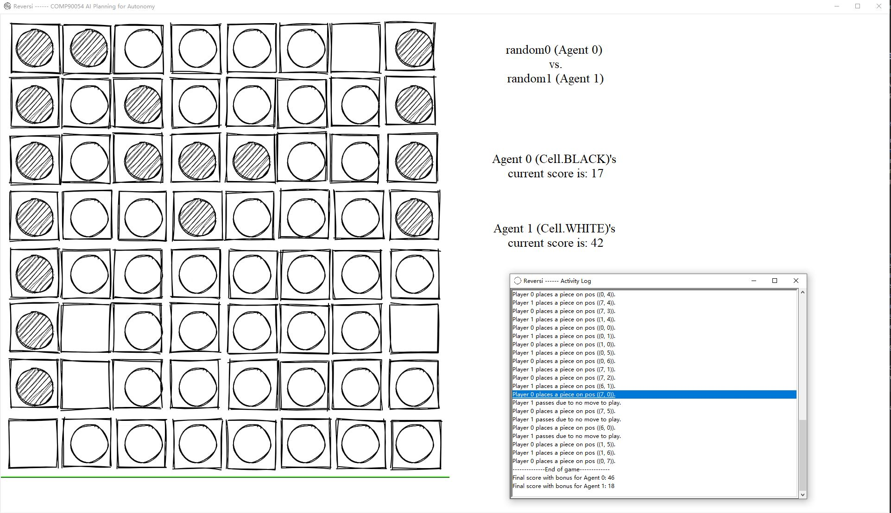

# AI Method 1 - Minimax

This section describes our Reversi AI approach based on the Minimax Algorithm with alpha-beta pruning to avoid 
unnecessary calculations, while focusing on the heuristics being used that made meaningful improvements in various
aspects.

# Table of Contents
- [Motivation](#motivation)
- [Application](#application)
- [Solved challenges](#solved-challenges)
- [Evolution and Experiments](#evolution-and-experiments)
- [Trade-offs](#trade-offs)
  * [Strengths](#strengths)
  * [Limitations](#limitations)
- [Future improvements](#future-improvements)

## Motivation  
It is kinda difficult to effectively utilise the traditional classical planning search algorithms at the first glance 
for this game due to its non-determinism (i.e., what the opponent will play in the next turn is not guaranteed), while 
the state space being super large, therefore measuring heuristics of a state could be a useful approximation of the goal 
states. Just like many decent human players would do, by measuring heuristics we are kinda like simulating what a human 
would think of a game state that to what degree that state has a better chance of winning than going for other actions.
Since Reversi is a zero-sum two player game, meaning if one party gains certain advantages, then the other part loses
them, therefore maximising a player's chances of wining minimises the other, and vice versa. This is why Minimax
becomes useful. As long as the heuristics are meaningful that measure domain knowledge in a reasonable degree, while
Minimax algorithm discovers the possibilities of all states within a pre-defined depth, the AI is expected to make moves
towards the most promising state to maximise its winning rate based on the measurement. The alpha-beta pruning technique 
additionally, is used to strive on making the agent return the action as soon as possible within the given time limit 
(1 second), therefore potentially allows us to increase the depth of the Minimax algorithm that makes the agent more 
informed about the available actions.

[Back to top](#table-of-contents)

## Application  
As mentioned previously, the program consists of mainly three parts, the Minimax algorithm, the alpha-beta pruning
technique and the heuristics. While Minimax with alpha-beta pruning can be used in many zero-sum games, the heuristics
are the main components that determine the overall performance of the AI towards a particular game problem, and are 
typically comprised of the relevant domain knowledge. 

The state defined in the algorithm remains the same as the one passed into the selectAction function as a parameter.
Original game functions such as getLegalActions are also used for the particular purposes, although they are slightly
modified in our own version for time efficiency. There's no explicit notion of a goal state in the algorithm, instead 
we use heuristics to measure the chances of winning as previously mentioned if a particular state is reached in the
future, however it is worth mentioning, while we dynamically change the weight for each heuristic component, at the 
very last move we measure the heuristic value purely based on the number of our pieces on board that matches what 
we would consider a win or loss for a typical goal state, the detail of weights is discussed later. The heuristic values
are purely measured on the deepest states bounded by the pre-defined depth, then the values are back-propagated to the parents
while their parents select the maximum or minimum one depending on whether the corresponding layer represents our turn
or the opponent's. The immediate action with the maximum heuristic value will be selected finally.

The depth we used for this Minimax program has been mainly 3 all the time throughout the development and was still 
available for our final version, that our program did not experience significant amount of timeout after our heuristic 
calculations were finalised. Going deeper such as depth=4 would result in timeout on server as we experienced before,
while shallower depth like depth=2 has indicated a lower performance based on experiments discussed later than depth=3 
due to its relative lack of information.

Our heuristic function evaluates the following components which are aggregated together to indicate the overall 
value of the evaluated state:
1. **Corner Heuristic:**

In the game state being evaluated, the number of corner squares we occupied V.S. the number of corner squares our 
opponent occupied. Measured in 25 * (our occupied corners - opponent's occupied corners), where 25 is a 'first layer
weight', that will be combined with the dynamic weight function later. It is worth mentioning here that the weight values
don't really matter as far as we discovered, but the relevance among all measurements. That is, for example, they can
all be measured within -100 and 100 or -1 and 1 that doesn't matter as long as all measurements remain consistent. For
our calculation, we tend to bound the values somewhere near -100 and 100 before assigning them another layer of weights,
exceptions apply to some other components discussed later.

Reason: Capturing corners is very important in most cases that usually significantly determines win or loss, since corners
captured will always be stable and makes the neighboring squares stable as well, while giving many opportunities in three
directions. The more corners captured, the more likely it is to win for that party in many cases.

2. **Piece Count Heuristic:**

In the game state being evaluated, the number of squares we occupied V.S. the number of squares our opponent occupied,
namely comparing the current score for us and for our opponents. This is measured in 100 * (our score - opponent score) 
/ (our score + opponent score), where 100 is also a 'first layer weight', and the latter calculation bounds the total 
value between -100 and 100.

Reason: It is how the win/loss is measured at the end, although in the early game we don't actually want to capture
too many pieces according to professional advices online and experiments, as it will give opponents more actions to
take that gains advantages over us. However,we do want to focus on capture as many as possible in the late game, and
that's why we enabled dynamic weights to shift focus just like a human would do based on the board time.

3. **Mobility Heuristic:**

Throughout the path (chain of actions) down to the game state being evaluated, the amount of actions we could take
in total V.S. the amount of actions our opponent could take in total. Measured in 100 * (our mobility - opponent mobility) 
/ (our mobility + opponent mobility) where mobility refers to amount of actions one could take throughout. 

Reason: The more actions we have, the more opportunities we have, and vice versa, such that in the best case limit
the opponent to choose from only bad moves that no matter what facilitate our advantages later.

4. **Stability Heuristic:**

Stability refers to the stable pieces which can't be flipped by any means. In the game state being evaluated, 
the number of our stable pieces V.S. the number of opponent's stable pieces. The calculation starts from the four 
corners, and spread around to the centre, since only corners are guaranteed to be stable at the first glance, while 
other squares depend on whether their neighbor squares from four different sets of directions are defined as stable. 
In short, stability calculation is executed two times in total for both us and our opponent, while each time stable 
pieces are added into a processing list starting from the corners, then we pop a stable piece each round to assess its 
neighbors until the calculation terminates. All stable pieces are guaranteed to be counted while all non-stable pieces 
are not, in our calculation. The final stability heuristic value is measured in our stability - opponent stability, 
with no 'first layer weight', since this value itself ranges from -64 and 64, the outer weight assigned later will be 
adjusted however to reflect its importance. Another worth mentioning point is, if no corner is occupied by one party, 
the stability value for that party is also 0.

Reason: Stable pieces cannot be flipped, therefore the more stable pieces we have the less pieces the opponent can
gain from, and vice versa.

5. **Static Weights Heuristic:**

In the game state being evaluated, our total static weights V.S. our opponent total static weights, based on the 
pre-defined static weights for each square occupied by the corresponding party and then add up together. The pre-defined
static weights we utilised captures the importance of each square in a general sense, and is used to guide our AI especially
in the early game. This heuristic value is measured in our total static weights - opponent total static weights.

Reason: Gives the AI some sort of indicator on whether placing a piece on a particular square is a good move, although
it is static that does not change throughout the game, which seems less effective, it does help the AI in terms of avoiding
bad moves in the early game especially squares that gives opponent opportunities to gain the corners.

6. **Frontier Heuristic:**

Frontier refers to a piece which its neighborhood contains empty square(s) (i.e., at least one of its 8 neighbor squares
is empty), that typically refers to pieces that give the other party potential opportunities to flip or place pieces. For
this heuristic, we measure our total number of empty square neighbors of all frontiers V.S. opponent's in the game state
being evaluated, with duplicates. It is calculated in 100 * (opponent frontier - our frontier) / (our frontier + opponent
frontier) where 100 is the 'first layer weight', and the latter value is bounded within -1 and 1.

Reason: The more frontiers we have, the more actions our opponent can take that can potentially limit us to only bad
moves. Striving on keeping our pieces surrounded provides potential opportunities later while limits the opponent's 
actions, as proven by professional advices and experiments. On the other hand, pieces surrounded by others are typically
relatively harder to be flipped since there's no immediate neighboring squares to directly flip them, whereas those surrounded
pieces are usually in the centre of a block(s), that are often helpful for example for later capturing corners.

More details about the characteristics and performance measurements are discussed later.

The heuristic values are summed up together at the end after their corresponding weights at the corresponding board time
(number of pieces on board) have been applied. The weights are designed for the following different phases:
1. **Early game (before 28 pieces on board):**

In the early phases, we don't really want too many pieces and probably 
counter intuitively we even want as fewer pieces as possible sometimes, because more pieces on board meaning more actions
for opponent that they have more opportunities to limit our moves, therefore we give a relatively very small weight and
even a negative weight for the piece count heuristic. While it is worth noting that, in the early game, the corner and 
stability heuristics are usually not relevant as in many cases no corner would be captured by either party, therefore
the other heuristics have become the dominators in the early game, namely the mobility, static weights and frontier. Although
in this case, we still value the corner and stability heuristics much higher than the others to encourage our agent capture
them if such cases happen even though it's rare. The weight values are designed based on observations during experiments, 
however our design intention is to make our AI pay more attention on the frontiers and static weights, while frontiers 
gives us more opportunities and limit the opponent's, the static weights avoid our agent place pieces especially around 
the corner(s) that allow the opponent to capture them later, and the mobility plays a certain less important role, 
typically when two states with similar frontier and static weights, that the mobility value could be the decision maker 
in that case.

2. **Middle game (after 27 pieces and before 57 pieces on board):**

In the middle game, corners are more likely to be captured
than in the early rounds. The weight for corner heuristic is designed to be much larger than the others to allow agent
take the corners as much as possible in most cases, while the weight for stability is also high, they won't conflict each
other as taking a corner is also taking a stable square. We slightly increased the weight for frontier as it becomes more
important usually than the others.

3. **Late game (after 56 pieces on board):** 

Each board time is measured individually however they are very similar and
share the same design principles, that is encourages getting as many pieces as possible while reducing the power of
other heuristics like mobility, static weights and frontier, as the opportunities they provide become meaningless as
the game approaches the end.

While our agent tries to make moves that facilitates the victory towards our side by considers those heuristics with 
varying weights in different game phases, it also tries to avoid or minimise the loss that the opponent can pose to us
by allowing the heuristic values being negative. That is, for example if the opponent can gain a corner or is likely
to gain a corner after we make an upcoming move(s), then the heuristic value would be negative, with a huge weight on the
corner heuristic, the agent will try to avoid that move which helps the opponent gain a corner by selecting the maximum one.

[Back to top](#table-of-contents)

## Solved Challenges
As the minimax algorithm has a relatively simple framework compared to other AI methods, the main challenges we encountered
throughout the development of this one come from how the heuristics should be measured and how the calculations 
could be improved, as discuss in the following:

1. **Lack of understanding towards the heuristic measurement**

  At the beginning especially, since none of us is familiar with how to play Reversi, it was quite hard for us
  to measure whether a specific game played by the AI agent or a single move is good and how to extract useful info
  from observations. Whereas this Minimax based AI method heavily relies on the heuristics based on the domain
  knowledge once the basic algorithm framework is established, therefore we were kinda struggling on how to improve
  the performance of our agent.

  In order to overcome this challenge, we looked for many research papers in this domain, for example what others 
  would think when implementing AI techniques for a particular game, especially for Reversi/Othello. We also searched
  for books that explain Reversi/Othello tricks and integrated some elements that could enhance the specific game
  thinking of our agent. Once we as developers learned some domain knowledge about the game, we also looked into some 
  specific game instances, especially the loss our agent during development played against different versions or the 
  random action player, to observe what actions our agent selected posed noticeable amount of ingredients to the loss,
  that we could analyse and look for relevant heuristic remedy to progressively enhance our agent performance.

2. **Measuring the weight for each heuristic component**
  
  Although the values for the weight for each heuristic component don't really matter by themselves, the relevance among all
  the components in the measurement does. We weren't able to decide on which heuristic component should be more important
  at a specific game phase due to our lack of domain knowledge, while it was also hard to visualise how different heuristic
  component would dominate each other in various circumstances due to the large amount of state spaces and the possible
  breadth of the Minimax Algorithm especially at where depth=3. Therefore, measuring the weight for each heuristic component
  was a guide-less task while it could somehow affect the performance of our agent.

  There's not much online discussion about this point as it's a specific thing, we could only look for answers via 
  experiments. We enabled prints in the meaningful code sections to print the relevant data at different stages, in order to 
  observe how the values could range at the specific game states. Typically, that if one heuristic component dominates
  the others by having a noticeably larger difference for many various circumstances based instances when it shouldn't, 
  we would decrease the weight for that one and observe again, etc. The final weights are tuned through such a way and 
  also based on our agent performance once after the adjustment against the previous performance.

3. **Heuristic calculation improvements for avoiding timeout on server**
  
  We noticed once the frontier heuristic is added, its effectiveness indeed benefits our agent in terms of gaining more
  actions generally, however, meanwhile more actions in Minimax resulted in significant computational cost increase that
  caused noticeable amount of timeouts on the server with the same depth. We observed it's not realistic to decrease the
  depth for a better performance, therefore we had to look into the code structure to perhaps algorithmically improve
  the computation efficiency in order to maintain the frontier heuristic for our agent as it's noticeable effective.

  We had already updated the generic functions or the game related functions such as generateSuccessor(), and it wasn't
  enough to bear the cost the frontier heuristic brings. We had to look into our heuristic calculations. We noticed many
  heuristics are calculated by iterating through the entire board (i.e., 8*8 times), namely the piece count heuristic,
  static weights and the frontier heuristics, although it's O(1), we are running such computations for all leaf states, 
  therefore a certain amount of time could have been saved if they could be optimised.
  We could actually combine their calculations together by just running
  one loop through the board instead of 3 times. This improvement did decrease the number of timeouts on the server as
  we noticed, however, timeout still happens sometimes although relatively rare, due to the large number of actions to
  be calculated. Especially when the opponent is also considering the frontier heuristic, both of us would generate
  a lot of game states within the depth that increases the likelihood of timeout. Such cases rarely happen that doesn't
  affect our agent performance too much overall, therefore the relevant improvements could be discovered as a future work.

[Back to top](#table-of-contents)

## Evolution and Experiments
This section describes the most meaningful phases of our Minimax development to picture the evolution of our Minimax
based AI agent, with some experiments to indicate the performance improvements and the potential reasons behind our
decisions on the particular improvements.

- **First version of our Minimax agent**

Our first version contains only the corner, piece count (score), mobility and stability heuristics, with the outer weight
for the piece count heuristic being -10 as 5 times our final version, as our early thought about limiting our pieces in
the early game to gain more actions whilst controlling the opponent's. Below is the result of running our first version
against the random agent over 100 games:
  
| Agent                 | WIN |
|-----------------------|:----|
| First Version Minimax | 96  |
| Random                | 4   |

However, although the win rate seems pretty high, it is against a random player who doesn't have any relevant knowledge
about the game, meaning it can't reflect the overall performance of our agent. We then downloaded some lost games from
the server that were played against other informed players, while also observing the specific moves in some particular 
games which our agent lost against the random player or the players from the server. We found that in most lost games,
there's a strong rationale which caused the loss, that our first version
isn't capable of effectively avoiding the opponent gaining corners, since our Minimax agent only considers a depth of 3,
it doesn't have any notion of the possible game states beyond depth=3, therefore it often places pieces near the corner(s)
that potentially helped the opponent gain corners eventually although not in the recent (after a certain number of moves
the opponent could gain the relevant corners via the pieces our agent placed nearby without our agent being able to avoid
it). This was when we considered having the static weight heuristic, with the ultimate goal to avoid our agent placing
pieces on the dangerous squares, especially the ones nearby the corners, that could allow the opponent access the corners.
Since the static weight value ranges within -56 and 56 while it's quite difficult to effectively normalise the value to
-100 and 100 like the others, we then assigned a dedicated outer weight based on observations while making it more dominating
in the early game as to achieve the aforementioned purpose. We tested our agent with the static weight heuristic against 
the one without it:
  
| Agent                      | White V.S. Black | Black V.S. White |
|----------------------------|:-----------------|:-----------------|
| Minimax with static weight | 43               | 52               |
| First Version Minimax      | 21               | 12               |

Our agent with the static weight heuristic was able to beat the previous version when play either white or black. While
in the games we indeed observed that our newer agent was able to avoid squares near the corners when there are other
better options, whilst the old one often gives opponent the opportunities to assess the corners as it has no notion about
it.

- **Corner, Stability Heuristic Calculations**

At the early stages, we used 100 * (our heuristic value - opponent's) / (our heuristic value + opponent's) for final
corner and stability heuristic calculations to range the value within -100 and 100 for a better weight management. However,
such a measurement poses potential inability to gain more corners or stable pieces when we already have some while the
opponent doesn't, and vice versa that when opponent has some of these pieces while we don't, we wouldn't try to avoid
them getting some more. Mathematically, 100 * (our heuristic value - 0) / (our heuristic value + 0) will always be 1
that the information of the possibility of getting more corners or stable pieces would be ignored in such a way. We observed
this through the specific moves of some games we played against others, after relevant modifications to avoid such a problem,
namely we decide to only care about "some weight * (our heuristic value - opponent's)", no such moves were observed.

- **Final Version of our Minimax agent**

While we were searching for more game theoretical tips, with the observations on the games the No.1 team on the server
played against the others, we noticed it's actually quite important to avoid having too many pieces in the early rounds,
while trying to make our pieces away from empty cells could potentially limit the opponent moves. This theory was also
reflected in the games we played against the other players on the server and also against random, where our agent before
this improvement often has quite a lot of pieces in the early game while the opponent has a few in the centre surrounded 
by ours that posed opportunities for them gaining the corners and flip our surrounding pieces with their inner ones later.
This theory is named frontiers in Reversi/Othello. Although our agent tries to limit the number of pieces in the early game
by placing a relatively big negative weight on the piece count heuristic, it doesn't seem to have theoretical significance
while its effectiveness isn't reflected in our experiments. We then adjusted the weight for piece count heuristic back
to normal (small), while integrated the frontier heuristic by counting the number of empty squares around our pieces in
the game state compared to the opponent's. We were able to see the agent tries to have much fewer pieces in the early game
while most pieces are surrounded in the centre when against other players and random. Below are the results for some
experiments we did on this:

  
| Agent                                        | White V.S. Black | Black V.S. White |
|----------------------------------------------|:-----------------|:-----------------|
| Minimax with frontier heuristic              | 48               | 46               |
| Previous Version Minimax, with static weight | 16               | 18               |

It is worth noting that, when the new Minimax version plays black against the old one, the old one had no chance but
to pass in the very late game which led to its loss even though it had huge advantages prior to that:

We also compared this version with our first version Minimax:

| Agent                           | White V.S. Black | Black V.S. White |
|---------------------------------|:-----------------|:-----------------|
| Minimax with frontier heuristic | 41               | 43               |
| First Version Minimax           | 23               | 21               |

Our final version of Minimax was able to beat the previous versions.

Finally, we compared our final version agent against the random player over 100 games:
  
| Agent                 | WIN |
|-----------------------|:----|
| Final Version Minimax | 99  |
| Random                | 1   |

Although it doesn't fully reflect the overall performance, we can still observe that the improvements made our agent
more stable.

- **Depth = 3 V.S. Depth = 2**

As previously mentioned, we observed a certain amount of loss caused by timeout on the server once the frontier heuristic
is added in, mainly due to large amount of available actions sometimes the frontier heuristic brings to us. We considered
downgrading the depth, the results of experiments are as follows:

| Agent                            | White V.S. Black | Black V.S. White |
|----------------------------------|:-----------------|:-----------------|
| Final Minimax agent with depth=3 | 61               | 41               |
| Final Minimax agent with depth=2 | 3                | 23               |

  
| Agent                            | White V.S. Black | Black V.S. White |
|----------------------------------|:-----------------|:-----------------|
| First Version Minimax (depth=3)  | 49               | 16               |
| Final Minimax agent with depth=2 | 15               | 18               |

  
| Agent                              | WIN |
|------------------------------------|:----|
| Final Version Minimax with depth=2 | 100 |
| Random                             | 0   |

Although the depth=2 version wasn't able to beat the depth=3 version, it doesn't seem too bad against the others. We
then tried this depth=2 version against players on the server, however the elo score somehow dropped a bit that it wasn't
able to beat the players we previously could. We finally decided to use the depth=3 version since the timeout incidents
don't affect the overall performance too much. 

It is worth noting that, when depth=3 for our Minimax agent, although we weighted much higher for the corner heuristic,
the agent doesn't always immediately place the corner squares when it could, however, it never lost that corner(s). The
reason behind is, when depth=3, there's another maximising layer after the opponent's minimising layer, such that if
the opponent couldn't avoid us taking that corner once we executed our first layer action, the agent could still place
the corner that gives the maximum value among the others, meaning basically the agent could either choose to place the
corner at the first layer move or the third, which the game states eventually gives the similar heuristic values. Whereas
when depth=2, the agent would immediately place the corner as it has no knowledge about what could happen beyond depth=2.
This somehow allows depth=3 agent think more broadly to facilitate the chances of winning.

[Back to top](#table-of-contents)

## Trade-offs  
### *Strengths*
1. One strength of the Minimax algorithm is, its framework is relatively simple compared to other AI techniques, and
it requires a few amount of work to modify the existing Minimax program into another agent for other zero-sum games, while
we as developers are mainly focusing on constructing the heuristic measurements, or in other words, building the 
relevant thinking for our AI agent based on domain knowledge and experiments.

2. This Minimax approach discovers all possible game states within the pre-defined depth, namely 3, therefore it has a 
wide sense and thorough assessments on the moves the agent should take assuming the opponent always play optimally and
based on the heuristics we measure. Such an approach facilitates our agent's decision-making in a more informed level, while
as long as the heuristics are measured in a meaningful and sensible manner, it has huge potentials in beating experienced
players to a certain extent, as it kinda simulates what a human player would measure, or think of the game situation once
a move is made.

### *Limitations*
1. Measuring heuristics effectively can be a tough task, and usually requires a huge amount of domain knowledge, while
some domain knowledge may be hard to be expressed in a mathematical manner therefore hard to implement. It often requires
a large amount of time resources to dig into the domain knowledge for a better heuristic, informed agent.

2. Although measuring heuristics under the Minimax framework has its advantages, the heuristics are somehow fixed thinking
strategies, meaning there's a potential boundary on what the agent could think of towards a particular game situation, that
it's often hard to beat more experienced expert players, since human players can think more specifically and flexibly, whereas
heuristic AI agent like Minimax is somehow limited.

3. In order to make sure the agent doesn't go over time in this project, also in many practical scenarios there would be
time limits for agents to make a decision, we have to sacrifice the depth in most cases. Since as the depth grows, the
computation cost increases significantly large, due to the huge branching factors, especially as the depth becomes larger,
increment by 1 would pose a significant computational difference. If we want to reach the actual goal states for most
games especially Reversi/Othello, it's almost impossible that it would be super slow.

4. Minimax is a sort of deterministic approach which assumes the opponent takes the best action based on our measurements,
meaning we could potentially lose opportunities to further maximise our chances of winning if the opponent doesn't go with
the one the algorithm would expect.

[Back to top](#table-of-contents)

## Future improvements
Our current overall heuristic measurement still requires some improvements in order to become a better and more 
informed agent, since our agent isn't guaranteed to win some basic agents when comparing with the random player and the versions
which we randomly adjusted weights on. One symbolic example is that, our final version Minimax agent could somehow lose
to a greedy agent who's trying to eat the most pieces in some way, due to its conservatism on keep as fewer pieces as possible
with the frontier heuristic. Following is a list of some possible improvements and the ones we would probably consider 
doing if we had more time:

1. Consideration of opening moves and anchor plays

Counter intuitively regarding the frontier heuristic, capturing more pieces in the first few moves could pose huge
advantages to the latter plays, as the first few moves are generally in the centre, allowing more opportunities to flip
around the opponent later. Whereas the anchor play is generally to push our agent towards placing pieces on the edge
when we don't have many pieces left that is sometimes often dangerous where the opponent can end the game early, while
also to balance the frontier heuristic. Those could be added into the heuristic measurements, or implement smarter 
mechanisms for our agent to react from.

2. Other heuristic strategies could be implemented.

For example, integrate the concept of tempo for our agent, which refers to transferring the burden of initiating play
to the opponent without offering them any new safe options. It is also noted in many Reversi/Othello books that gaining
a corner doesn't always mean a good move and also for the opponent. Our agent currently strives on getting corners as
much as possible by having a huge weight, however this thinking may be too fixed that more experienced players can establish
rare strategies against it.

3. Assess the usefulness of mobility

Currently, the mobility heuristic doesn't seem to have explicit usefulness in our experiments although noted in many
places online. We could perhaps research for this aspect more via more experiments to assess its usefulness, whether 
we should adjust its weight or measure it in a different way.

4. Stability and Frontier Heuristic Calculations

Both calculations take most of the time resource each time we evaluate a game state, there could be possible potentials
on further optimising the time complexity of their calculations in an algorithmic way.

[Back to top](#table-of-contents)
