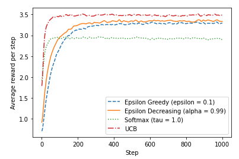
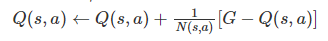
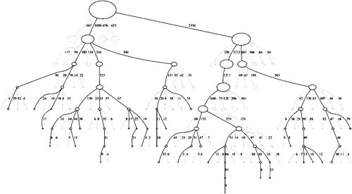

# AI Method 2 - Monte Carlo Tree Search

# Table of Contents
- [Motivation](#motivation)
- [Application](#application)
- [Solved challenges](#solved-challenges)
- [Trade-offs](#trade-offs)
  * [Advantages](#advantages)
  * [Disadvantages](#disadvantages)
- [Future improvements](#future-improvements)

## Motivation  
After introducing the first method, we can see that the disadvantage of this approach is that we need to design a suitable 
heuristic function ourselves, the design of this function is very difficult and it is not realistic to always have experienced 
players artificially and carefully modulate these evaluation functions. Therefore, we want to implement another approach to solve 
this problem effectively. We can do it without knowing Reversi's prior knowledge and experience, just the rules of the game. 
The Monte Carlo method, a "statistical simulation method", can be used to implement our idea.


[Back to top](#table-of-contents)

## Application  

In general, the algorithm works by continuously simulating each move until the endgame, and the total number of simulations N for that move, versus the number of wins W, to derive the win rate for that move as W/N. An asymmetric search tree is gradually built by randomly extrapolating the game.
Monte Carlo is model-free reinforcement learning, which is also consistent with the reality (we do not know how our opponent will land next and the probability) or that the state space is so large that it is difficult for us to describe it.

Monte Carlo tree search can be roughly divided into four steps. Selection, Expansion, Simulation, and Back Propagation. In this game, each *game_state* is a state.
The _action_ is the set of legal actions for next player, which are represented by the positions (x, y) where the pieces can be placed.

At the beginning, the search tree has only one node, which is the situation we need to decide on. Each node in the search tree contains three basic pieces of information: 1. The situation it represents 2. The number of times it has been visited 3. Its cumulative score. 
It also includes properties of a directional nature, such as whether the node is a node on the maximizer or a node on the minimizer in this game. When determining whether a node is the node on the Maximizer or the node on the Minimizer
first query the corresponding parent node to determine whether the node is a Maximizer node or a minimizer node by nature. For example, in the first round, the root node is a Maximizer node by default, which means we start as a Maximizer node.

**Implementation:**

The following shows the implementation of the core part of the code (which may involve some detailed descriptions that are not particularly important and we will do our best to explain them initially).
First, the four steps of selection, expansion, simulation and backpropagation from the heel nodes are performed to simulate as many pairs of games as possible within a specified time frame.
So, we don't defined how many episodes. We manually define a maximum time frame (for example 0.96 seconds) and stop the creation of the tree at the end of the execution.
````
    def mcts(self, timeout=TIMEOUT, root_node=None):
        if root_node is None:
            root_node = self.create_root_node()

        start_time = time.time()
        current_time = time.time()
        while current_time < start_time + timeout:
            # Find a state node to expand
            selected_node = root_node.select()
            if not self.mdp.is_terminal(selected_node.state):
                child = selected_node.expand()
                reward = self.simulate(child)
                selected_node.back_propagate(reward, child)

            current_time = time.time()
        return root_node
````
How do I select a node at the beginning? ( ````selected_node = root_node.select()````)

    def select(self):
        if not self.is_fully_expanded() or self.mdp.is_terminal(self.state):
            return self
        else:
            """Otherwise fully expanded and not terminal state"""
            actions = list(self.children.keys())
            action = self.bandit.select(embedReversiState(self.state, self.agent_id),
                                        actions, self.qfunction, Node.visits, self.agent_id == self.mdp.init_agent_id)
            return self.get_outcome_child(action).select()

Each game is played by choosing the next move from the root node. `select` method will iterate over each child node to select the node with the multi-armed bandit algorithm (The `select` method will be called recursively until it reaches a node that is not fully expanded or a terminal node.). 
The specific approaches taken here is **Upper Confidence Trees(UCT) strategy**. The Upper Confidence Trees (UCT) algorithm is the combination of MCTS with the UCB1 strategy。
UCB1 is chosen because of stability, flexibility and simple mathematical formula. It has been proven to better balance the "exploration" and "exploitation" for an accumulated average return reward.

Another key point is in `self.bandit.select()`.
Depending on whether the node is ours or the adversary's (who executes the next action in this state), you need to choose the maximum and minimum values respectively



When we select nodes, we go down to a node where all of its children are visited at least once.
For the selected node, randomly pick an action to expand the node (we create a new “leaf” node(an object of `Node` class)).
Then, we do the simulation for the leaf node. 

Simulation process(```reward = self.simulate(child)```):

    def simulate(self, node):
        state = node.state
        cumulative_reward = 0.0
        depth = 0
        current_agent = node.agent_id

        while not self.mdp.is_terminal(state):
            # Choose an action to execute
            action = self.choose(state, current_agent)

            # Execute the action
            (next_state, reward) = self.mdp.execute(state, action, current_agent)

            # Discount the reward
            cumulative_reward += pow(self.mdp.get_discount_factor(), depth) * reward
            depth += 1
            state = next_state
            current_agent = 1 - current_agent

        return cumulative_reward
···

    def choose(self, state, agent_id):
        actions = self.mdp.get_actions(state, agent_id)

        for action in actions:
            if action in [(0, 0), (0, GRID_SIZE - 1), (GRID_SIZE - 1, 0), (GRID_SIZE - 1, GRID_SIZE - 1)]:
                return action

        return random.choice(actions)

Pass the node into the simulate function to simulate it. We use **RollOutPolicy - Random Rollout**, which means that we are guring out a simulated execution policy in testing in the algorithm.
So, in our code, the `choose()` method is always being "random choosing". However, we do a little improvement here that if the valid actions(x,y) contain any corner location, we would probabilistically choose a corner position.
Because in the first AI method, we have found corner locations as a beneficial location. It could reduce the probability of AI/agent loosing a turn.
About the **depth of the simulation process**, we stop it until the game ends. 
    


Back-Propagate (```selected_node.back_propagate(reward, child)```):


        def back_propagate(self, reward, child):
        action = child.action

        embeddedState = embedReversiState(self.state, self.agent_id)

        Node.visits[embeddedState] += 1
        Node.visits[(embeddedState, action)] += 1

        delta = (1 / (Node.visits[(embeddedState, action)])) * (
                reward - self.qfunction.get_q_value(embeddedState, action)
        )
        self.qfunction.update(embeddedState, action, delta)

        if self.parent:  # if parent is not None
            self.parent.back_propagate(self.reward + reward, self)

Final step for the one round mcst, is to update all nodes on the path. At the end of roll-out, 
value will be back-propagated **(Agent awards one point for winning a match, one point for losing a mandatory match, and zero points for a tie)**,
the value will increase or decrease the size of reward accumulated(not only the immediate reward).
Then we would use the value to update Q-value for each node in simulations based on the following Q-function. 



As you can see, the delta value is means a little increment or decrement of probability. Then we accumulate the delta to form the final Q-value.
In our code, Q-value is stored as a dictionary, the key is a tuple of (`embeddedState`, `action`), the value is the Q-value for that state.
All of these are encapsulated in the `Qfunction` class. When the trainning done, the **Q table** are updated with the rewards obtained after each episode, showing the players the most successful path to an end state. 
Except the Q-value, a counter `Node.visit` is the record of how many times the states have been involved in simulation process.
We use these two value to calculate the UCB for multi-armed bandit algorithm, which is helpful to next select process.


Above basically is the main implementation of the MCST in our code and what the specific policy we chose.


## Performance
With the random agent, we achieved 100% MCTS wins. But only roughly 40% win rate when playing against "minmax agent"(our first AI method - 1st version).
The reasons for the phenomenon would be:
 1. simulation time is insufficient. We have tried to set the simulation time up to 3 seconds and found MCTS win rates increase to around 60%.
 2. MCST strategy is specially useful to the "random agent", because, in the process of simulation, we also used the **random-policy** to choose the next action. (more accurate)

## Evolution
To have a better performance, we have to think about some enhancements. For this algorithm, we tried to optimise the select process.
Specifically, each time we start a game, the agent have to select an action in the root node, performing a MCST based on multi-bandit algorithm.
It means that it have to do some exploration. However, for human beings, For experienced players, they will go straight to the valuable positions.
So, we want to cancel the initial time waste to do exploration. We performed the self-training to record the Q-table and visits table into `.cvs` file. 
(As the more game played, the Q-table will contain more accurate values.)

And then, read it to initialise the `Q-function` and `Node.visits` for new games so that the agent could directly choose the best choice instead of exploration.

After training 100 games. We find out that it has a better performance:
  
| Agent              | WIN |
|--------------------|:---|
| MCTS               | 46% |
| MCTS after training | 64%|

But not as much as we expected, which might because the episodes number are not enough. And another 
guess is that MCTS is a reinforcement learning based on theorem of large numbers, 
even if we save the self-trained Q-value, the adversary will continue to learn by reinforcement, 
and it may choose different actions based on the data from the on-line simulation, so that the improvement is not obvious in the experiment.


[Back to top](#table-of-contents)

## Solved Challenges

1. Choosing valid actions for a state.

In the reversi game, the valid actions is based on agent/player id except for state. So in the complex process of simulation, we have to make sure that the action is valid for the current state. The best solution is save the agent is as object variable,
which is easy and clear to use.
2. Comparing two given states to see if they are the same.

Since `state` is kind of objects, we cannot directly compare them because they are not the same object(they will return their address).
The best solution is rewrite the `__eq__` method in the `ReversiState` class, which is easy to use and clear to understand. But we cannot make changes to the original code.

So we abstract the attributes from state (the `state.board` and `state.agent_id`) and convert them into string datatype to see if they are the same.
The method actually also works for that improvement of MCST.(writing/reading the Q-value and visits table into/from `.cvs` file)

[Back to top](#table-of-contents)


## Trade-offs  

Based on the theorem behind it that supports it (the theorem of large numbers), we can know that performance and time are what we need to balance and the entry point for improvement.

### *Advantages*  
MCTS provides a better approach than traditional tree search.

**Aheuristic** - 
MCTS does not require any knowledge of the given domain strategy or specific practices to make reasonable decisions. The algorithm can work effectively without any knowledge of the game beyond the basic rules; this means that a simple MCTS implementation can be reused in many games with only minor adjustments, so this also makes MCTS a good approach for general games.

**Asymmetric** - 
MCTS performs an asymmetric growth of the topology of the adaptive search space of the tree. This algorithm visits more interesting nodes more frequently and focuses its search time on the more relevant parts of the tree.



This makes MCTS more suitable for games that have larger branching factors, such as Go with 19X19. Such a large combinatorial space can cause problems for standard depth- or width-based search methods, so the adaptability of MCTS suggests that it can (eventually) find those more optimal moves and focus its search efforts on those parts.

**Any time** - 
The algorithm can terminate at any time and return the most current estimate. The currently constructed search tree can be discarded or made available for subsequent reuse.

### *Disadvantages*
Firstly, MCTS, in its basic form, can fail to find reasonable moves for games even of medium complexity within a reasonable amount of time.
Then, MCTS search can take many iterations to converge to a good solution, which can be an issue for more general applications that are difficult to optimise.


[Back to top](#table-of-contents)

## Future improvements  
The main enhancements can be considered from the following aspects: 1. Our tree policy is basically learned from scratch; 2. The Rollout Policy we use is also completely random (because we do not have any prior knowledge); 3. In the reverse process we use the simplest Q-Table.

A deep convolutional neural network can be used to train the value network and the policy network. The policy network will be mainly used to determine the probability that this action can be won.
Value networks are then used to predict the value of each position on the board and then use these values at each node to select the best move.  

We believe it can be optimized to get a better algorithm after combining these two networks with the above three areas.

Moreover, we think adding some domain knowledge to the algorithm can also improve the performance of the algorithm. For example, we can add a heuristic function to the rollout policy to make the algorithm more efficient.

Domain knowledge specific to the current game can be help filter out unlikely moves or to produce rollouts that are more 
similar to the ones that would occur between human opponents. This has the benefit of rollout results that will be more realistic than random simulations and that nodes will require fewer iterations to yield realistic reward values.


[Back to top](#table-of-contents)
