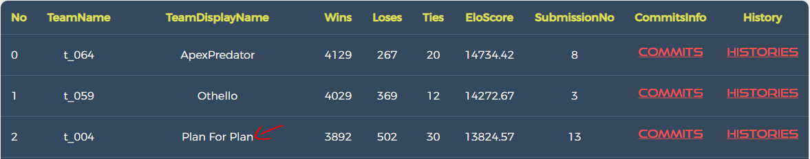

# Analysis of the problem

Analysis the problem

explain which are the techniques that you choose and why

Our final agent is decided to be our AI method 1 - Minimax, upon performance comparison and experiments.

We firstly compared both against the random player:
  
| Agent                 | WIN |
|-----------------------|:----|
| Final Version Minimax | 99  |
| Random                | 1   |

  
| Agent                 | WIN |
|-----------------------|:----|
| MCTS (with pre train) | 100 |
| Random                | 0   |

It seems like no explicit information could be reflected from against random players as both techniques are showing
similar performance.

We then posted the techniques onto the server to observe the practical performance of both. The first one Minimax
achieved No.3 on the server eventually, whereas our MCTS approach fell into No.30+ after the upload. 

We then compared their performance against each other by observing 10 games:
  
| Agent                 | WIN |
|-----------------------|:----|
| Final Version Minimax | 9   |
| MCTS (with pre train) | 1   |

From our observations, our MCTS approach still contains some sort of guide-less randomness that the actions it took sometimes
posed noticeable disadvantages to itself. Although it won 1 game against our final version of Minimax, we noticed it was 
the lack of effectiveness of our heuristic measurements that some actions our Minimax method executed posed advantages to
the opponents regarding taking the corners in that lost game, which could be further evaluation in our future improvement phases.

Another important factor we have considered is, while the state space of this game being super large, with the time limit
of this project, our MCTS is theoretically ineffective without large amount of training data to guide the Q values of the actions 
for particular states. Since we are selecting random actions throughout the simulations, the time required to converge is
much high in this scenario where state space is also pretty huge. Therefore, our current version of MCTS in practice 
isn't a better choice than our Minimax method which contains heuristic guidance rather than its 'incomplete randomness'.

Overall, without considering the potential improvements of both methods, where although MCTS could be much more informed
than our Minimax agent if the proposed neural networks in the corresponding aspects could be integrated with enough amount
of training, the current version of our MCTS lacks such abilities therefore we are less confident of selecting it than selecting
our Minimax method as our final agent.

## General Comments regarding the project
On top of the two approaches we proposed, there could be many interesting methods towards the problem this project is 
aiming for. For example, Alpha-Zero on top of MCTS as we mentioned in the further improvements of our MCTS approach, 
Minimax in combination with MCTS, or even traditional search algorithms could make some sort of significance, while
Minimax itself is very configurable by measuring the heuristics. We observed the diversity of various AI techniques 
throughout this project that we could think about in the future to tackle specific programs.

## Offense
 - **AI method 1 - Minimax:**

Offense plays in Minimax are reflected by selecting the most promising action with the maximum heuristic value among
all the options once all possible states within the pre-defined depth are thoroughly assessed based on our heuristic
measurements. For example if an action can lead to occupying a corner, our Minimax agent would usually consider executing
actions towards it. Where in the late game, the agent will play moves that maximise the number of our pieces on board which
in turn minimise the opponent's.

 - **AI method 2 -Monte Carlo Tree Search (MCTS):**

There's no explicit notion of offense in our MCTS approach, since we run simulations to observe the most promising actions.

## Defense
 - **AI method 1 - Minimax:**

Defense plays in Minimax are reflected by selecting the action with the maximum heuristic value which in turn avoid
selecting the action that could benefit the opponent, or minimise the benefits the opponent can gain from. Since this
is a zero-sum game, meaning if one party benefits then the other one loses. As a notion of defense, since we allow the 
heuristic values to be negative if the opponent takes the advantages, in a very bad case where we are dominated by
the opponent, the heuristic values of the evaluated game states would be negative, in which case our agent would select
the one that poses the smallest loss by selecting the maximum one, therefore defending the opponent from gaining more
opportunities.

 - **AI method 2 -Monte Carlo Tree Search (MCTS):**

There's no explicit notion of defense in our MCTS approach, since we run simulations to observe the most promising actions.

# Conclusions and Learnings
Throughout this project, we experienced two AI techniques to tackle this specific game program. 

While developing our first agent Minimax, after we possessed the knowledge of the algorithm structure, most of the time 
we are searching for the ways to integrate the domain knowledge into an AI heuristic format. From the Minimax AI method development, 
we gained a strong feeling on how Artificial Intelligence could somehow think like a human that measures the game states 
to make the most promising actions based on the integrated knowledge as a human would possess. There are still quite a lot
of potentials to integrate more specific domain knowledge in a programmatic manner to enhance the thinking of our Minimax
agent. 

Throughout our MCTS development, we were more focusing on combining the MCTS algorithm with the game framework and 
the relevant technical improvements, especially how to converge the Q values as quick as possible while satisfying the time limit,
and that is why we considered training the Q values by running simulations that could perhaps help the MCTS especially
at the start to be more informative than having to discover from scratch. However, we realised it would require a significant
amount of training instances to be able to make noticeable improvements due to the large state space of this problem. While
the improvements are less observable in progress. Neural Networks could be used to guide the policies and values as discovered
in various papers as our future improvements towards this approach. Some other techniques like 